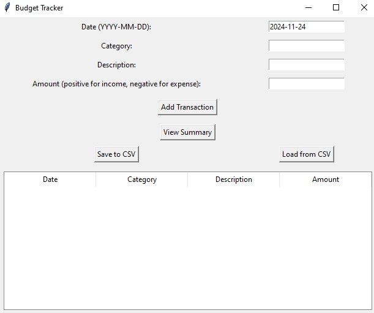
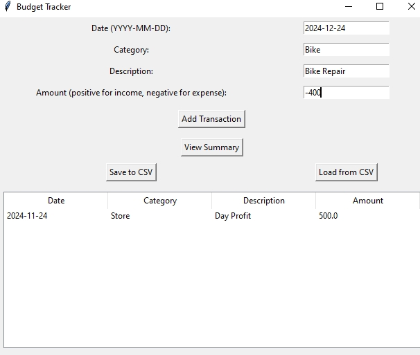
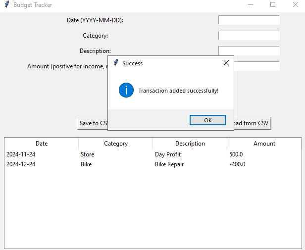

# Budget Tracker GUI

A simple desktop application to manage your finances by tracking income and expenses. This user-friendly tool lets you add transactions, view summaries, and store your data for future use.

## Features

- **Add Transactions**: Record your income and expenses with details like date, category, description, and amount.
- **View Transactions**: Displays all your recorded transactions in an easy-to-read table.
- **Summary**:
  - View your **total income**, **total expenses**, and **remaining balance**.
- **Save Data**: Save your financial records as a CSV file for future reference.
- **Load Data**: Import your previously saved data to continue tracking seamlessly.

## How to Use

1. Launch the application.
2. Enter details for a transaction (date, category, description, and amount).
3. Click "Add Transaction" to save the entry.
4. Use the "View Summary" button to get an overview of your income and expenses.
5. Save your data by clicking "Save to CSV" or reload data with "Load from CSV."

## Screenshots

### Main Interface

### Working 

### Transaction

